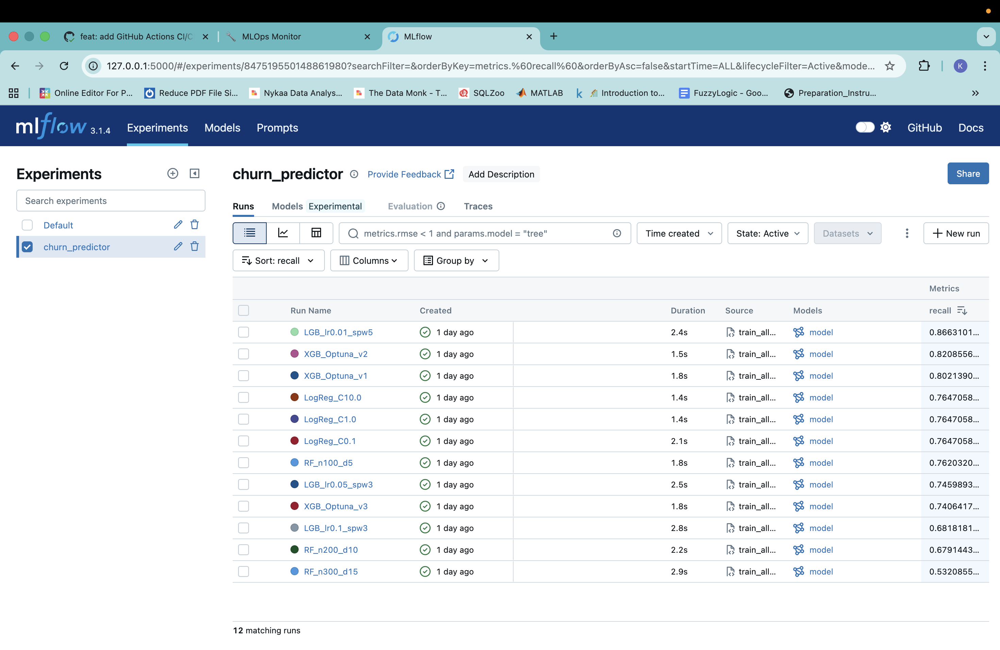
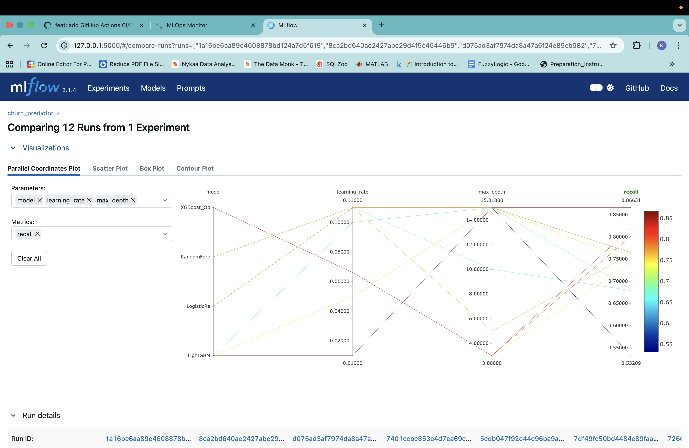
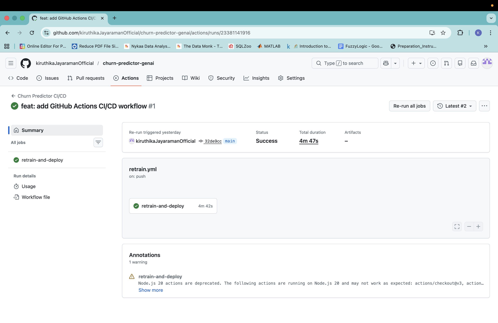
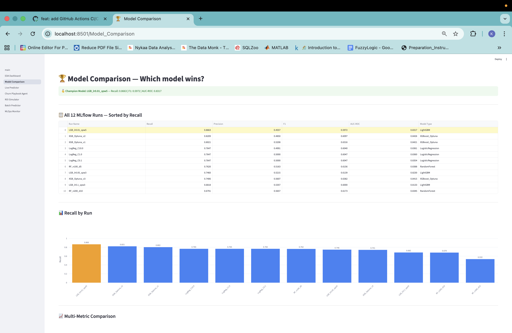
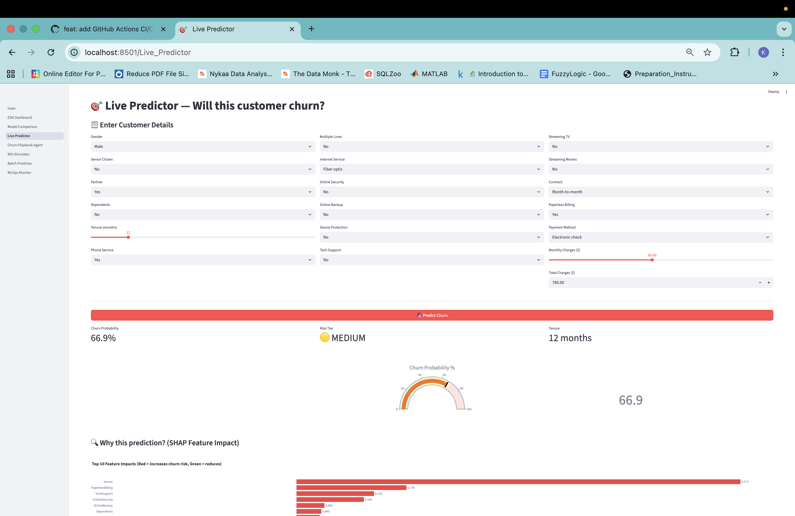
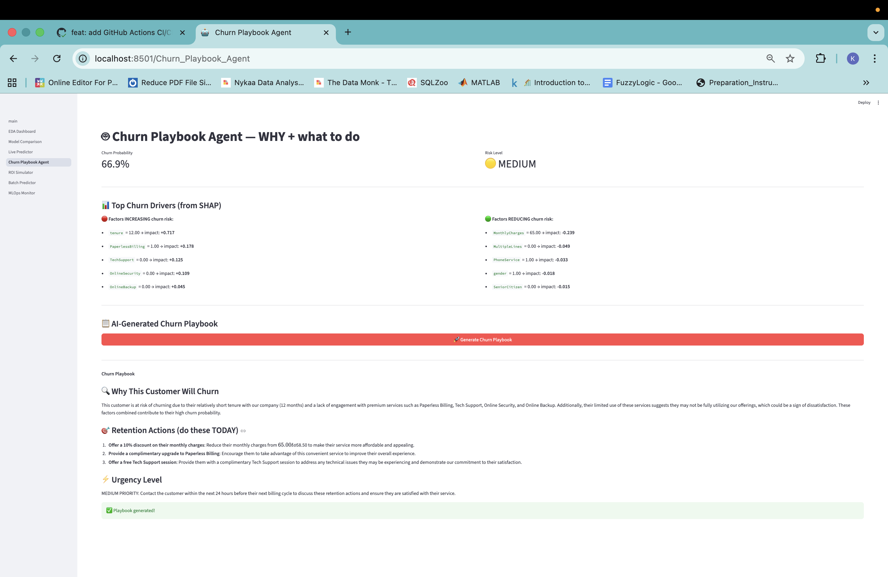
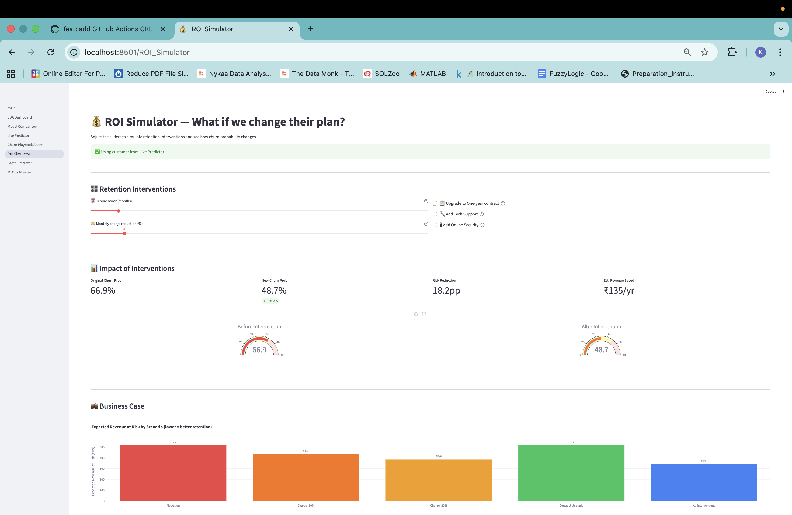
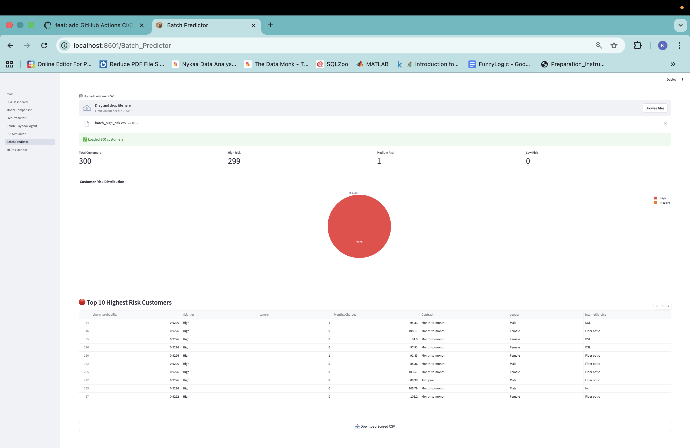
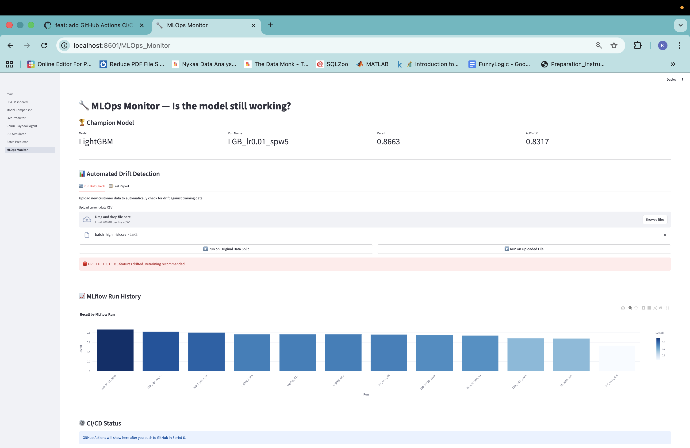
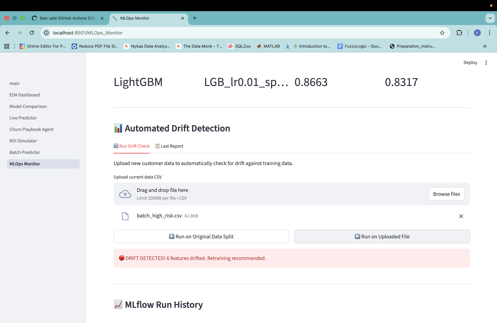

# 🔮 Churn Predictor + GenAI Agent

[](https://python.org)
[](https://lightgbm.readthedocs.io)
[](https://mlflow.org)
[](https://langchain.com)
[](https://shap.readthedocs.io)
[](https://fastapi.tiangolo.com)
[](https://docker.com)
[](https://github.com/features/actions)
[](https://evidentlyai.com)
[](https://streamlit.io)
[](https://optuna.org)
[](https://groq.com)

**Production-grade telecom churn prediction system** — 12-run MLflow experiment · SHAP per-customer explainability · LangChain GenAI retention agent · automated drift detection · FastAPI + Docker + GitHub Actions CI/CD · 7-page Streamlit app

### 🚀 [Live Dashboard](https://churn-predictor-genai-kdtpnqu2jyzrgelekjjbbq.streamlit.app/)

---

## 🎯 The Business Problem

Telecom companies lose **₹12+ lakh/month** from silent customer churn. Traditional retention teams react *after* a customer cancels — too late, too expensive.

> **This system predicts which customer will churn 30 days before it happens, explains exactly WHY per customer using SHAP, and generates a specific AI-powered retention playbook — automatically.**

| Without This System | With This System |
|---|---|
| React after customer cancels | Predict 30 days before they leave |
| Call center contacts random customers | Score entire customer base in one CSV upload |
| No idea why customer churned | SHAP explains top 5 reasons per customer |
| Model trained once, silently degrades | Evidently AI detects drift → auto-retrain |
| ML only on data scientist's laptop | Live REST API + 7-page web app for the whole team |
| CFO asks "what's the ROI?" | ROI Simulator calculates revenue saved per intervention |

**Dataset:** IBM Telco Customer Churn · 7,043 customers · 20 features · 26.5% churn rate · Kaggle

---

## 📊 Proven Results

| Metric | Value |
|--------|-------|
| **Champion Model** | LightGBM (`LGB_lr0.01_spw5`) |
| **Recall** | **86.63%** — catches 87 out of every 100 churners |
| **AUC-ROC** | 0.8317 |
| **Total Customers** | 7,043 · Churned: 1,869 · Churn Rate: 26.5% |
| **Avg Monthly Charges** | ₹64.76 |
| **MLflow Runs** | 12 across 4 algorithms (LR · RF · LightGBM · XGBoost+Optuna) |
| **Batch Test** | 300 high-risk customers → 299/300 correctly flagged (**99.7%**) |
| **Drift Test** | 6 features drifted on shifted distribution → retraining triggered |
| **CI/CD Pipeline** | Docker build + push in **4m 47s** · Status: ✅ Success |
| **API Response** | `{"churn_probability": 0.892, "risk_tier": "High"}` · < 200ms |

> **Why Recall over Accuracy?**
> Missing a churner = ₹780/year lost forever. Wrong flag on loyal customer = ₹50 discount.
> Recall-first is the correct business objective — not accuracy.

---

## 🏆 MLflow — 12-Run Experiment



```
Run Name            Recall    Precision    F1      AUC-ROC   Model
────────────────────────────────────────────────────────────────────
LGB_lr0.01_spw5    0.8663    0.4557      0.5972   0.8317    LightGBM    ← 🏆 CHAMPION
XGB_Optuna_v2      0.8209    0.4850      0.6097   0.8426    XGBoost
XGB_Optuna_v1      0.8021    0.5208      0.6316   0.8421    XGBoost
LogReg_C10.0       0.7647    0.4991      0.6040   0.8361    LogisticReg
RF_n100_d5         0.7620    0.5163      0.6156   0.8388    RandomForest
RF_n300_d15        0.5321    0.6104      0.5686   0.8209    RandomForest ← worst
```



*Parallel coordinates — all 12 runs · red lines = highest recall · LightGBM at lr=0.01 dominates top*

---

## ⚙️ GitHub Actions CI/CD — Green ✅



```
Triggers: push to main + every Monday 6AM UTC + workflow_dispatch
Steps: checkout → pip install → data validation → docker build → docker push
Result: Docker image deployed to Docker Hub in 4m 47s ✅
```

---

## 📸 7-Page App

### Page 1 — EDA Dashboard


**7,043 customers · 1,869 churned · 26.5% rate · ₹64.76 avg monthly**
Month-to-month: **42.7%** churn · One year: **11.3%** · Two year: **2.8%**

---

### Page 2 — Model Comparison



*Champion `LGB_lr0.01_spw5` highlighted in gold · 12 runs sorted by recall*

---

### Page 3 — Live Predictor ← Key Page



*Fiber optic · Month-to-month · Tenure 12m · ₹65/month → **66.9% · 🟡 MEDIUM**
SHAP: tenure +0.717 · PaperlessBilling +0.178 · TechSupport +0.125*

---

### Page 4 — Churn Playbook Agent



*LangChain + Groq LLaMA 3.1 streams specific retention actions per customer*

---

### Page 5 — ROI Simulator



*66.9% → 48.7% churn · Risk reduction: 18.2pp · Revenue saved: ₹135/yr*

---

### Page 6 — Batch Predictor



*300 high-risk customers → **299 High · 1 Medium · 0 Low** (99.7%)*

---

### Page 7 — MLOps Monitor





*Normal data: 0 drift ✅ · High-risk batch: 🔴 6 features drifted · retraining recommended*

---

## 🏗️ System Architecture

```
┌─────────────────────────────────────────────────────────────┐
│  DATA LAYER                                                 │
│  IBM Telco · 7,043 customers · 20 features · 26.5% churn  │
│  Great Expectations · 5 data quality checks · all pass     │
└────────────────────┬────────────────────────────────────────┘
                     │
┌────────────────────▼────────────────────────────────────────┐
│  EXPERIMENT LAYER — 12-run MLflow Comparison                │
│  LR×3 · RF×3 · LightGBM×3 · XGBoost+Optuna×3             │
│  Champion: LGB_lr0.01_spw5 · Recall 86.63% · AUC 0.8317  │
└────────────────────┬────────────────────────────────────────┘
                     │
┌────────────────────▼────────────────────────────────────────┐
│  EXPLAINABILITY LAYER                                       │
│  SHAP TreeExplainer → tenure +0.717 · Billing +0.178      │
│  Waterfall chart per prediction · top 5 pos + neg drivers  │
└────────────────────┬────────────────────────────────────────┘
                     │
┌────────────────────▼────────────────────────────────────────┐
│  GENAI LAYER  ← Unique differentiator                       │
│  LangChain + Groq LLaMA 3.1-8B-Instant · streamed output  │
│  66.9% prob + SHAP → plain-English WHY + 3 actions        │
└────────────────────┬────────────────────────────────────────┘
                     │
┌────────────────────▼────────────────────────────────────────┐
│  SERVING LAYER                                              │
│  FastAPI POST /predict → 0.892 · High · < 200ms           │
│  Streamlit 7-page · Docker containerised                   │
└────────────────────┬────────────────────────────────────────┘
                     │
┌────────────────────▼────────────────────────────────────────┐
│  MLOPS LAYER                                                │
│  Evidently AI · 0 drift normal · 6 drift high-risk        │
│  GitHub Actions · push → Docker Hub · 4m 47s · ✅         │
│  Every Monday 6AM UTC auto-retrain                         │
└─────────────────────────────────────────────────────────────┘
```

---

## ⚡ Technology Stack

| Category | Technology | Purpose |
|----------|-----------|---------|
| **ML Models** | LightGBM · XGBoost · Random Forest · Logistic Regression | 4 algorithms · 12 MLflow runs |
| **Hyperparameter Tuning** | Optuna (50 trials) | Recall-maximising Bayesian search |
| **Explainability** | SHAP TreeExplainer | Per-customer waterfall charts |
| **GenAI** | LangChain + Groq LLaMA 3.1-8B-Instant | Streaming retention playbook |
| **Experiment Tracking** | MLflow 3.1.4 | Run comparison · model registry |
| **Drift Monitoring** | Evidently AI 0.4.30 | Automated distribution shift detection |
| **Data Validation** | Great Expectations | 5 production data quality checks |
| **REST API** | FastAPI + Uvicorn | POST /predict · JSON · < 200ms |
| **Web App** | Streamlit + Plotly | 7-page interactive dashboard |
| **Containerisation** | Docker | Reproducible · cloud-ready |
| **CI/CD** | GitHub Actions | Auto build + push · 4m 47s pipeline |
| **Deployment** | Streamlit Cloud | Live public URL |
| **Language** | Python 3.9 | Mac M3 · VS Code |

---

## 🚀 Quick Start

```bash
git clone https://github.com/kiruthikaJayaramanOfficial/churn-predictor-genai.git
cd churn-predictor-genai
python3 -m venv churn_env && source churn_env/bin/activate
brew install libomp   # Mac only
pip install -r requirements.txt
echo "GROQ_API_KEY=your_key_here" > .env
# Download telco_churn.csv from Kaggle → save as data/telco_churn.csv
python src/train_all_models.py   # trains all 12 models (~5 mins)
streamlit run app/main.py        # http://localhost:8501
uvicorn app.api:app --reload     # http://localhost:8000
```

---

## 📁 Project Structure

```
churn-predictor-genai/
├── app/
│   ├── main.py · api.py
│   └── pages/ (7 pages)
├── src/
│   ├── eda.py · data_validation.py
│   ├── train_all_models.py · explainability.py
│   └── langchain_agent.py
├── mlops/
│   └── drift_detector.py · drift_summary.json
├── eval/generate_test_data.py
├── data/ · models/ · docs/screenshots/
├── .github/workflows/retrain.yml
└── Dockerfile · requirements.txt
```

---

## 🔑 ATS Keywords

`Machine Learning` `LightGBM` `XGBoost` `Random Forest` `Logistic Regression`
`MLflow` `Experiment Tracking` `Model Registry` `Hyperparameter Tuning` `Optuna`
`SHAP` `Explainable AI` `XAI` `Feature Importance` `Interpretable ML`
`LangChain` `LLM` `Generative AI` `GenAI` `Prompt Engineering` `Groq` `LLaMA`
`FastAPI` `REST API` `Docker` `Containerisation` `GitHub Actions` `CI/CD`
`Evidently AI` `Data Drift` `Model Monitoring` `MLOps` `Great Expectations`
`Customer Churn` `Churn Prediction` `Telecom` `BFSI` `Binary Classification`
`Recall` `AUC-ROC` `Class Imbalance` `Python` `Streamlit` `Production ML`

---

## 📌 Resume Bullet

```
LightGBM churn predictor (86.6% recall) from systematic 12-run MLflow
comparison across 4 algorithms (LR, RF, LightGBM, XGBoost+Optuna);
LightGBM Champion via lr=0.01/spw=5 manual tuning · XGBoost tuned via
Optuna 50-trial Bayesian search; LangChain + Groq agent generating
plain-English Churn Playbook with SHAP explainability per customer;
FastAPI + Docker + GitHub Actions CI/CD (4m 47s) with automated
Evidently AI drift monitoring (6-feature drift detected on distribution
shift); 7-page Streamlit app with live predictor, ROI simulator, batch
scorer (99.7% on high-risk batch), MLOps monitor — deployed
```

---

## 📬 Contact

**Kiruthika Jayaraman** · VIT Chennai

[](https://github.com/kiruthikaJayaramanOfficial)

---

*Production MLOps · GenAI layer · Real Telco data · 12-run systematic experiment · Automated retraining*

**⭐ Star this repo if you found it useful!**
